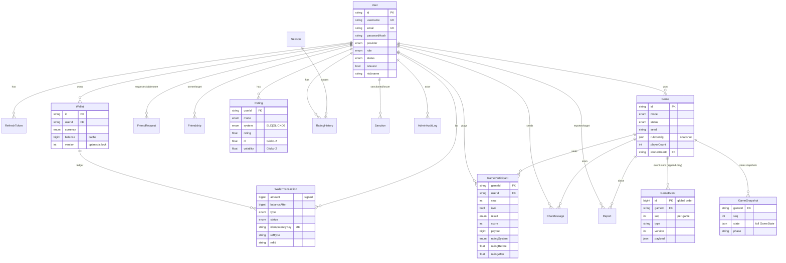

# @gostop/db

Single source of truth for the PostgreSQL schema (Prisma) and the generated
client. Consumed by `backend-api` (auth/member/ranking/admin) and `backend-game`
(append-only event writes).

## Commands

```bash
# from repo root
pnpm --filter @gostop/db db:generate    # generate client into ./generated/prisma
pnpm --filter @gostop/db db:migrate      # create + apply a dev migration
pnpm --filter @gostop/db db:deploy       # apply migrations (prod/CI)
pnpm --filter @gostop/db db:validate     # validate schema
pnpm --filter @gostop/db db:studio       # browse data
```

`DATABASE_URL` must be set (see root `.env.example`).

## Conventions

- **Common columns on every model**: `createdAt`, `updatedAt`, `deletedAt`.
- **Soft delete**: `deletedAt = NULL` means a live row. A Prisma Client
  extension (added in step 10) rewrites `find*`/`delete*` to filter
  `deletedAt: null` and turn deletes into `deletedAt = now()`. Immutable ledgers
  (`game_events`, `wallet_transactions`, `game_snapshots`) keep the column for
  uniformity but are never soft-deleted.
- **Money** is `BigInt` in the smallest unit — never floats.
- **Append-only truth, cached aggregates**: `wallet_transactions` is the ledger;
  `wallets.balance` is a transactional cache. `game_events` is the event store;
  `games.*` outcome fields and `game_snapshots` are derived/optimisations.

## ERD



## Replay performance (GameSnapshot)

To reconstruct a game at event `seq = N`:

1. Load the latest `GameSnapshot` where `seq <= N` (or the initial state from `seed`).
2. Apply `GameEvent`s in `(gameId, seq)` order from there to `N`.

Snapshots are written every K events (and at game end), so replay is O(K)
instead of O(total events) — important for the admin replay viewer.
